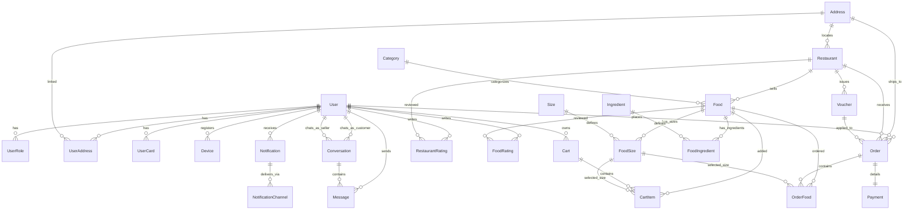

# Food Delivery Backend (NestJS)


An enterprise-ready, modular food delivery backend built with NestJS, Prisma ORM, and Bun runtime.

---

## 🚀 Project Overview & Architecture

This repository acts as the scalable core backend for a food delivery ecosystem. It exposes RESTful APIs and real-time WebSockets to handle user management, vendor dashboards, dynamic food menus with sizes, cart management, payments, order workflows, and real-time chat.

### 🏛️ System Architecture

The application is structured following modern NestJS module-based architecture:

- **Modular Modules:** Each domain feature (Auth, User, Restaurant, Food, Cart, Order, Payment, Chat, Conversation, Notification) is isolated in its own folder under `src/modules/` containing dedicated controllers, services, and data transfer objects (DTOs).
- **Domain Event Pub/Sub:** Decoupled event emissions via `@nestjs/event-emitter` to run secondary tasks (e.g. pushing Firebase devices/in-app notifications, updating database status logs) asynchronously without blocking primary execution threads.
- **Data Persistence:** Prisma ORM abstraction using PostgreSQL, utilizing client extensions for transparent global soft deletes (`deleteAt` timestamping).
- **Real-Time Communication:** Bi-directional real-time chat over WebSockets (Socket.IO rooms) authenticated with JWT guard checks.
- **Storage Service:** Local or cloud S3/Minio bucket uploads for static media assets (such as conversation image attachments, food photos, and restaurant covers).

---

## 📁 Folder Structure

- `src/` - Application source code
  - `modules/` - Business domain modules (Auth, Order, Notification, etc.)
  - `bases/` - Generic application bases (guards, filters, interceptors, decorators)
  - `prisma/` - Prisma custom client initialization and soft-delete extensions
  - `realtime/` - Socket.IO gateway and chat handlers
  - `main.ts` - NestJS application bootstrap entrypoint
- `prisma/` - Database schema, migrations, and seed scripts
- `docs/` - Support documentation and guides

---

## ⚡ Setup & Local Execution

### 1. Install Dependencies
```bash
bun install
```

### 2. Configure Environment Variables
Copy the template environment file and fill in your connection details (Database URL, JWT Secret, Minio keys, Firebase credentials, etc.):
```bash
cp .env.example .env
```

### 3. Database Migration & Seeding
Synchronize the PostgreSQL schema and seed the initial dataset:
```bash
bun prisma db push
bun prisma generate
bun prisma db seed
```

### 4. Run the Server
- **Development Mode:**
  ```bash
  bun dev
  ```
- **Production Mode:**
  ```bash
  bun run build
  bun run start
  ```

---

## 📐 Database Diagram (ERD)



---

## 🧪 Testing
```bash
# Run unit and E2E integration tests
bun test
```
