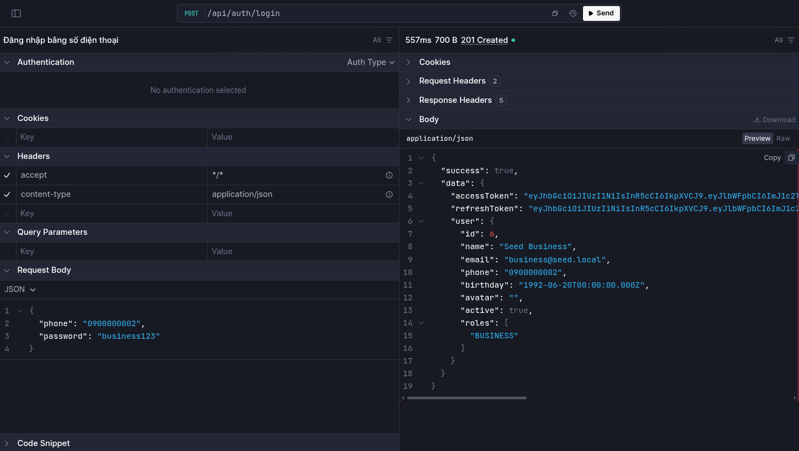
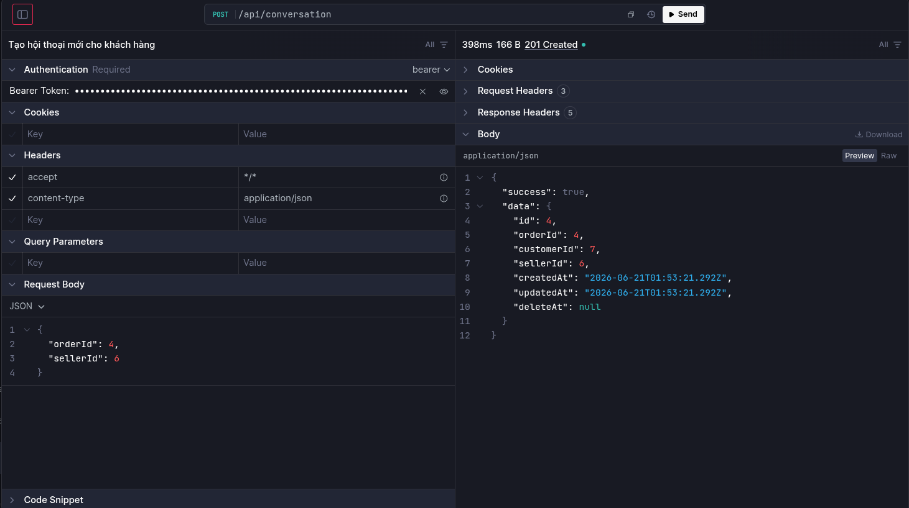
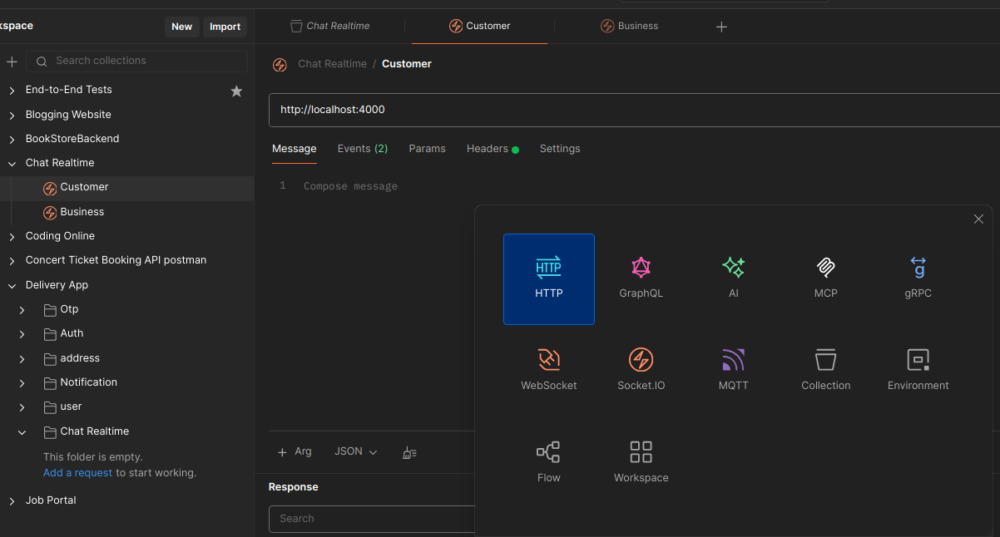
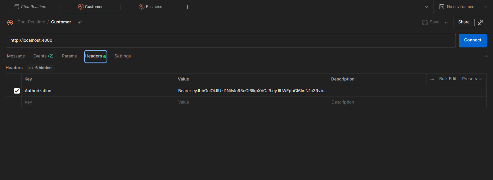
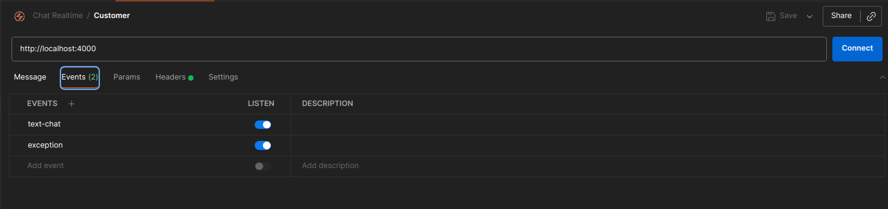
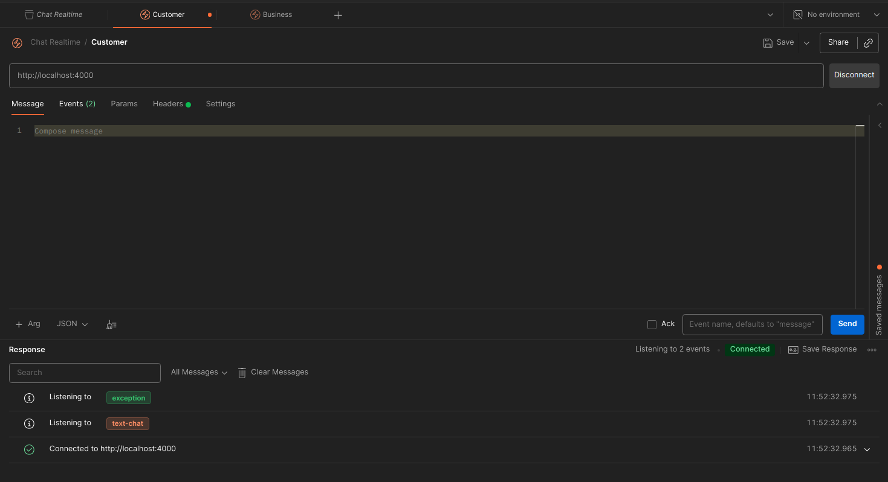
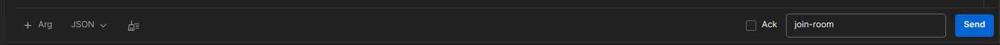
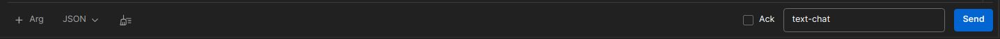
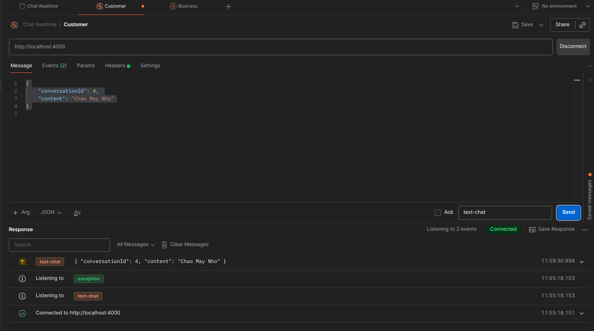
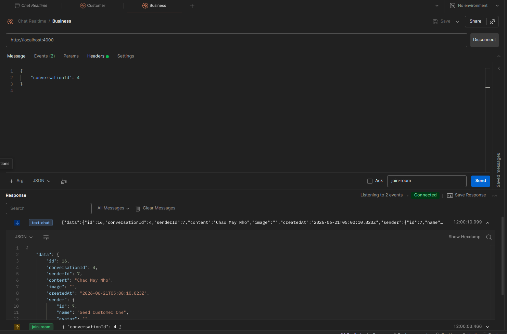

# HƯỚNG DẪN THAO TÁC CHAT REALTIME

Các API liên quan đến conversation ở API doc: http://localhost:4000/api/docs chỉ liên quan đến các thao tác với các đoạn hội thoại người dùng.

Để test chức năng App realtime. Chúng ta sẽ phải sử dụng Postman và SocketIO

Trong docs dưới đây. Customer = Khách hàng; Seller/Restaurant = người bán đồ án (ăn)

## Bước 1. Đăng nhập tài khoản Customer & Seller

- Đầu tiên, chúng ta sẽ đăng nhập một tài khoản của Customer và một tài khoản của Restaurant để có thể lấy được Access Token

Customer:

```json
{
    "phone": "0900000003",
    "password": "123456"
}
```

Restaurant:

```json
{
    "phone": "0900000002",
    "password": "business123"
}
```



- Lưu trữ Access Token của 2 người. Trong ví dụ trên thì tôi sẽ dùng Customer (id = 4) và Restaurant (id = 6)

## Bước 2. Tạo một cuộc hội thoại

- API route: `http://localhost:4000/api/conversation` (POST)

Chúng ta sẽ dùng Token của Customer để tạo hoặc lấy đoạn hội thoại duy nhất giữa Customer và Seller.

```json
{
    "sellerId": 6
}
```



- Sau khi hoàn thành thì nó sẽ tạo cho chúng ta một cuộc hội thoại (conversation). Hãy lưu trữ lại conversationId của đoạn hội thoại này. Trong ví dụ trên, conversationId = 4

## Bước 3. Dùng Socket.IO trong Postman

- Hãy mở Postman lên và tạo một 2 tab SocketIO, đại diện cho 2 kênh chat của người bán và người mua



_Chọn new -> Socket.IO, ở ví dụ trên lả 2 tab chat Customer và Business_

## Bước 4. Một số cài đặt ban đầu cho từng tab Postman

Tiến hành chạy Backend bằng lệnh: `bun dev`

**Cài đặt Authentication**

Trong tab `Header` của từng tab Socket. Hãy dán JWT Token của Customer và Restaurant vào để hoàn thành việc xác thực



**Listener event**:

Hệ thống Backend cung cấp 3 event là _join-room_, _text-chat_, _exception_

- join-room: Tham gia vào một conversation. Nó sẽ nhận vào conversationId (đã tạo ở bước trên) và giúp người dùng tham gia vào conversation này
- text-chat: Nhận vào content (Nội dung người dùng gửi) và đẩy đến bên kia.
- exception: Báo lỗi khi có lỗi xảy ra

Chúng ta phải tiến hành đăng ký việc Listen cho event (join-room không cần listen)

Trong tab Event. Hãy điền tên các event vào (làm cho cả 2 tab SocketIO)



**Kết nối**

Chạy Backend: `bun dev` và nhập đường link Backend (http://localhost:4000) lên trên ô URL của từng tab SocketIO

Bấm nút Connect để kết nối. Hãy đảm bảo có giao diện như bên dưới



## Bước 5. Nhắn tin qua lại

Sau khi cả 2 tab SocketIO đã kết nối đến Backend rồi. Thì chúng ta sẽ tiến hành join-room cho từng tab SocketIO

Ở body thì nhập vào conversationId mà muốn join. Ở bên dưới thì nhập tên event là join-room. Nhớ đổi dạng sang JSON. Thực hiện join-room event cho cả 2 tab SocketIO.

```json
{
    "conversationId": 4
}
```



## Nhắn tin

Bây giờ mình sẽ làm một thao tác từ Customer nhắn tin qua Seller thử.

ở tab Customer của SocketIO. Hãy thay đổi body:

```json
{
    "conversationId": 4,
    "content": "Chao May Nho"
}
```

Đổi event sang _text-chat_ -> Bấm Send




Bây giờ qua bên tab Seller/Business/Restaurant gì gì đó... Nó sẽ nhận được tin nhắn do customer gửi sang



Tương tự, để gửi ngược lại thì bạn chỉ cần đổi body bên trong Seller

```json
{
    "conversationId": 4,
    "content": "Sao do"
}
```

Để gửi hình ảnh thì tiến hành upload hình ảnh lên trên conversation bằng đường link: `http://localhost:4000/api/conversation/upload-image`. Rồi gửi kèm thêm trường image vào trong body

```json
{
    "conversationId": 4,
    "content": "sao do",
    "image": "http://localhost:9000/jobportal/example.jpg"
}
```
