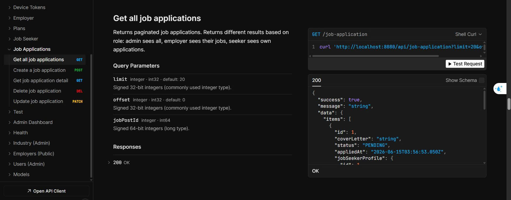

# BỔ SUNG TÀI LIỆU CHO BACKEND

---
- Yêu cầu ngôn ngữ: Tiếng Việt 
- Nội dung: ngắn gọn, cô đọng, phù hợp với con người đọc. Không nên dùng văn quá AI, gây cảm giác khỏ hiểu. 
---

## 1. Chú thích cho API docs 
**Vấn đề**: Hiện tại, khi chúng ta truy cập API docs (http://localhost:4000/api/docs), nó vẫn chưa có các chú thích cụ thể cho từng đường link API để cho thằng Thắng Lê nó biết 

**Yêu cầu:** Hãy tiến hành thêm các chú thích / mô tả vào bên trong API docs (scalar), cùng với các example body trong request để Thắng Lê nó dễ dàng trong việc gọi API. Có thể xem cụ thể ở hình ảnh bên dưới.

java

## 2. Tài liệu hướng dẫn sử dụng hệ thống backend 
**Vấn đề**: Tài liệu trong thư mục docs của Backend chưa đầy đủ. Chúng ta vẫn chưa có các tài liệu hướng dẫn sử dụng cụ thể. 

**Yêu cầu:** Hãy tìm hiểu và soạn các tài liệu hướng dẫn như sau: 

+ be-guide.md: Tài liệu hướng dẫn setup và chạy Backend trong môi trường development (local)
+ conversation-guide.md: Hệ thống của chúng ta có chức chat realtime. Tài liệu này sẽ hướng dẫn cho bên Frontend làm sao để call API, sử dụng chức năng chat realtime do Backend cung cấp. 
+ notification-guide.md: Hệ thống có hỗ trợ thông báo thông qua 2 channel: `IN_APP` (nút chuông trong ứng dụng) và `IN_DEVICE` (qua firebase). Hãy viết tài liệu để hướng dẫn cho Frontend call API và sử dụng chức năng này 
+ database-guide.md: Tài liệu giải thích công dụng của các trường bên trong từng bảng của database. 

Tất cả các tài liệu `*-guide.md` phải được đặt bên trong thư mục `guide` tại đường dẫn: 
`docs/guide/`

## 3. Testing 
- Thực hiện việc kiểm thử cho các đường link API của bên Backend. 

### Deadline: Tối 20/6/2026 phải có được các documents. Việc kiểm thử có thể để qua ngày mai. 
